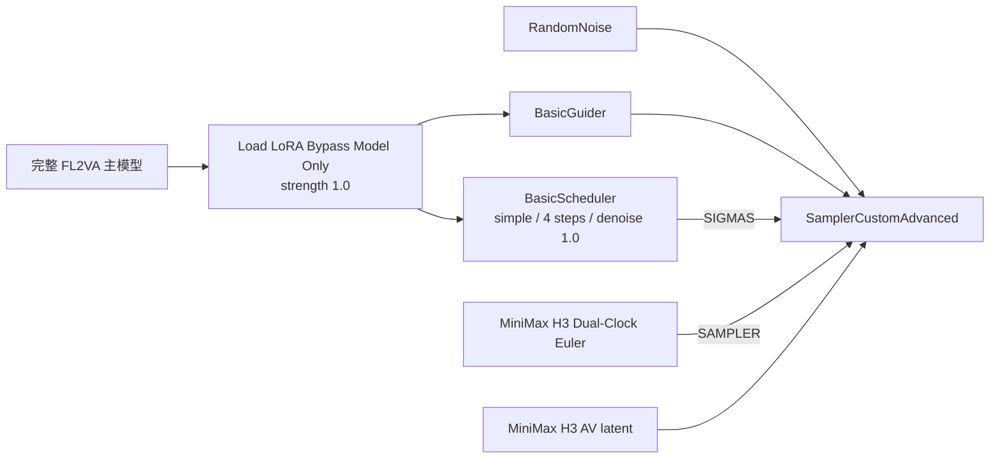

# ComfyUI MiniMax-H3 双时钟 Euler 采样器

[简体中文](README.md) | [English](README_EN.md)

MiniMax-H3 音视频采样兼容节点。它最初为 [MiniMax-H3 Turbo LoRA](https://huggingface.co/larryvrh/MiniMax-H3-Turbo-Lora) 补充双时钟 Euler 积分，解决4步生成时的严重爆音、削波和噪声化音频。ComfyUI 自提交 [`bdcb886`](https://github.com/comfyanonymous/ComfyUI/commit/bdcb886a4705a03cf40f4a7226de9fc7c059fc90) 起已原生支持 MiniMax-H3 AV flow；在这些新版本中，本节点会自动转交给官方 `euler`，主要用于保持旧工作流兼容。

本仓库不包含、镜像或重新分发 MiniMax-H3 主模型、VAE、文本编码器或 Turbo LoRA 权重。

> [!IMPORTANT]
> **先确认 ComfyUI 版本：**从提交 [`bdcb886`](https://github.com/comfyanonymous/ComfyUI/commit/bdcb886a4705a03cf40f4a7226de9fc7c059fc90)（2026-08-06 nightly）开始，ComfyUI 已内置 MiniMax-H3 原生 AV 采样修复。该提交及更高版本直接使用官方 `KSamplerSelect: euler` 即可，不再需要本插件修复爆音。由于当时 ComfyUI 的源码版本号仍显示 `0.30.0`，这里以提交号或是否存在 `comfy.model_sampling.ModelSamplingAV` 为准，而不是仅看界面版本号。

> [!WARNING]
> **原生采样修复不等于 Turbo LoRA 可以直接加载。**对于本 README 验证的初始版 `minimax_h3_turbo_4step.safetensors`，仍需先给 LoRA 键添加 `diffusion_model.` 前缀，再使用 `Load LoRA (Bypass, Model Only)` / `加载LoRA（旁路，仅模型）（用于调试）`，强度从 `1.0` 开始。不要因为新版 ComfyUI 已修复采样器，就跳过 LoRA 转换或改用普通合并权重式加载器。

> [!TIP]
> 如果必须停留在 `bdcb886` 之前的 ComfyUI，安装本插件并把 `MiniMax H3 Dual-Clock Euler` 接到 `SamplerCustomAdvanced.sampler`；插件会启用旧版手动双时钟路径。新版 ComfyUI 中也可以保留该节点，插件会自动转交给官方 Euler，旧工作流无需重新接线。

> [!NOTE]
> 这不是 LoRA 作者或 Comfy-Org 发布的官方 ComfyUI 节点。旧版兼容路径的采样数学复刻自作者的 [`generate.py`](https://huggingface.co/larryvrh/MiniMax-H3-Turbo-Lora/blob/main/generate.py)。插件同时测试了旧版 ComfyUI `14b05228cef127ce529bc0c08660770d4af3e9a8` 的手动双时钟路径，以及新版 `a464ac33588ae182f81a090d910cfbf21e255b73` 的原生 AV Euler 路径。

## 快速开始

如果目标是先跑通一条正确的 4 步工作流，请严格按下面 6 步操作。不要先改调度器、LoRA 强度或 shift。

### 1. 选择完整、未剪枝的 FL2VA 主模型

从 [Comfy-Org/MiniMax-H3](https://huggingface.co/Comfy-Org/MiniMax-H3) 下载下列其中一个主模型：

```text
minimax_h3_fl2va_bf16.safetensors
```

或者资源占用更低、已在 ComfyUI 本地验证的：

```text
minimax_h3_fl2va_int8_convrot.safetensors
```

不要选择名称中带 `pruned` 的版本。精度可以是 BF16 或完整 INT8 ConvRot，关键是必须保留 LoRA 所针对的完整 AdaLN 层结构。文本编码器可使用官方 BF16 或 INT8 ConvRot；VAE 使用官方 `minimax_h3_video_vae_fp16.safetensors` 和 `minimax_h3_audio_vae_fp32.safetensors`。

### 2. 安装本节点（新版可选，旧工作流推荐）

```bash
cd ComfyUI/custom_nodes
git clone https://github.com/shuaixn/ComfyUI-MiniMaxH3DualClockSampler.git
```

最新版 ComfyUI 可以直接使用官方 `KSamplerSelect: euler`，无需安装本节点。已有工作流使用本节点时，安装或更新它可以保留原节点 ID，避免工作流变红。安装后完全重启 ComfyUI，然后搜索：

```text
MiniMax H3 Dual-Clock Euler
```

### 3. 下载并转换作者的 Turbo LoRA

只下载作者仓库中的普通非 EMA 版本：

```text
minimax_h3_turbo_4step.safetensors
```

来源：[larryvrh/MiniMax-H3-Turbo-Lora](https://huggingface.co/larryvrh/MiniMax-H3-Turbo-Lora/tree/main)

原文件的键名缺少 ComfyUI 所需的 `diffusion_model.` 前缀。在本仓库目录运行：

```bash
python convert_h3_lora_for_comfyui.py \
  /path/to/minimax_h3_turbo_4step.safetensors \
  /path/to/ComfyUI/models/loras/minimax_h3_turbo_4step_comfyui.safetensors
```

Windows 便携版用户应使用 ComfyUI 自带 Python，例如：

```powershell
C:\ComfyUI_windows_portable\python_embeded\python.exe .\convert_h3_lora_for_comfyui.py `
  "D:\Downloads\minimax_h3_turbo_4step.safetensors" `
  "C:\ComfyUI_windows_portable\ComfyUI\models\loras\minimax_h3_turbo_4step_comfyui.safetensors"
```

转换只修改键名前缀，不改变 tensor 数值、dtype、shape、rank 或 LoRA 强度。转换完成后在 ComfyUI 中刷新模型列表。

### 4. 使用旁路 LoRA 加载器

在工作流中使用：

```text
Load LoRA (Bypass, Model Only)
加载LoRA（旁路，仅模型）（用于调试）
```

选择转换后的 `_comfyui.safetensors`，将 `strength_model` 设为 `1.0`。旁路加载器保留作者的运行时 `base(x) + B(A(x))` 语义；不要用普通合并权重式 LoRA 加载器替代。

将旁路加载器输出的模型同时连接到 `BasicGuider` 和 `BasicScheduler`。

### 5. 选择采样器

从官方 [T2V](https://github.com/Comfy-Org/workflow_templates/blob/main/templates/video_minimax_h3_t2v.json)、[I2V](https://github.com/Comfy-Org/workflow_templates/blob/main/templates/video_minimax_h3_i2v.json) 或 [R2V](https://github.com/Comfy-Org/workflow_templates/blob/main/templates/video_minimax_h3_r2v.json) 模板开始。

对于包含原生 AV 修复的最新版 ComfyUI，保留官方 `KSamplerSelect` 并选择 `euler` 即可。也可以删除或旁路 `KSamplerSelect`，把本节点的 `sampler` 输出接到 `SamplerCustomAdvanced.sampler`；节点会自动转交给同一个官方 Euler。旧版 ComfyUI 则会自动使用插件内置的双时钟实现。其余噪声、引导器、latent、VAE 和视频合成接线保持不变。


### 6. 使用经过验证的参数

```text
LoRA loader: Load LoRA (Bypass, Model Only)
LoRA strength: 1.0
sampler: KSamplerSelect/euler（新版）或 MiniMax H3 Dual-Clock Euler
scheduler: simple
steps: 4（速度优先）或 8（更干净）
denoise: 1.0
guider: BasicGuider
video shift: 12
audio shift: 3
```

新版 ComfyUI 的 `ModelSamplingAV` 会在模型层原生完成音视频 schedule 对齐，本节点不会重复修正。使用本节点时，日志应出现：

```text
[MiniMaxH3DualClock] Native ComfyUI AV sampling detected; delegating to stock Euler.
```

旧版 ComfyUI 才会运行原来的严格校验和手动双时钟循环，其日志为：

```text
[MiniMaxH3DualClock] Euler sampling with video shift 12.0, audio shift 3.0, ...
[MiniMaxH3DualClock] Rebuilt 4-step sigma grid from the author's multiplicative shift-12 schedule.
```

## 目录

- [快速开始](#快速开始)
- [它解决什么问题](#它解决什么问题)
- [参数速查](#参数速查)
- [兼容性与文件选择](#兼容性与文件选择)
- [安装节点](#安装节点)
- [下载与转换 Turbo LoRA](#下载与转换-turbo-lora)
- [工作流接线](#工作流接线)
- [推荐参数](#推荐参数)
- [工作原理](#工作原理)
- [如何确认真正生效](#如何确认真正生效)
- [常见错误与排查](#常见错误与排查)
- [开发与测试](#开发与测试)
- [来源、致谢与许可](#来源致谢与许可)

## 它解决什么问题

MiniMax-H3 同时生成视频 latent 和立体声音频 latent，但二者使用不同的 flow schedule：

- 视频：`shift = 12`
- 音频：`shift = 3`

旧版 H3 实现通过把音频速度乘上 `dσ_audio / dσ_video` 来适配单 schedule 采样器。约20步时这个局部近似尚可；降到4步时，尤其最后几步跨度很大，会严重过冲音频 schedule，表现为：

- 爆音或削波；
- 持续高能噪声；
- 声音像损坏的数据流；
- 视频看起来正常，但音频完全不可用。

在旧版 ComfyUI 中，本节点恢复原始音频速度并用音频自己的 sigma 差值积分。在新版 ComfyUI 中，核心的 `ModelSamplingAV` 会把音频 latent 映射到视频采样坐标，普通 Euler 因而可以精确推进两条流；本节点检测到该能力后直接返回官方 Euler，避免重复校正。

## 参数速查

第一次使用请严格采用下面这组组合：

| 项目 | 推荐值 |
|---|---|
| 主模型 | 完整、未剪枝的 FL2VA BF16 或 INT8 ConvRot |
| LoRA | `minimax_h3_turbo_4step.safetensors`，非 EMA |
| LoRA 格式 | 所有键添加 `diffusion_model.` 前缀后的 ComfyUI 版本 |
| LoRA 加载器 | `加载LoRA（旁路，仅模型）（用于调试）` / `Load LoRA (Bypass, Model Only)` |
| LoRA 强度 | `1.0` |
| 采样器 | 新版：官方 `KSamplerSelect: euler`；兼容节点：`MiniMax H3 Dual-Clock Euler` |
| 调度器 | ComfyUI `BasicScheduler` 的 `simple` |
| 步数 | 先用 `4`；质量优先可用 `8` |
| CFG | `BasicGuider` 路径，不额外设置 CFG；等价起点为 `1.0` |
| denoise | `1.0` |
| 视频 shift | 固定 `12` |
| 音频 shift | 固定 `3` |

在不包含 `ModelSamplingAV` 的旧版 ComfyUI 中，不要把以下组合当作双时钟方案：

- 普通 `KSamplerSelect: euler`；
- `Euler + Beta`；
- `res_multistep`；
- 仅使用自定义 sigma 节点，但仍让一个普通采样器同时更新两条流。

这些旧版路径没有执行音频独立积分。新版 ComfyUI 的官方 Euler 是例外：核心已经原生完成 AV flow 变换，因此不再需要自定义 sampler。讨论区早期出现的 `Euler + Beta` 仍不是推荐配置。

## 兼容性与文件选择

### 已验证环境

- 旧版兼容路径：ComfyUI `14b05228cef127ce529bc0c08660770d4af3e9a8`
- 新版原生 AV 路径：ComfyUI `a464ac33588ae182f81a090d910cfbf21e255b73`（包含原生修复 `bdcb886a4705a03cf40f4a7226de9fc7c059fc90`）
- ComfyUI version：`v0.30.0`
- Python：ComfyUI 自带 Python 3.13 环境
- 主模型：`minimax_h3_fl2va_int8_convrot.safetensors`，完整未剪枝版
- LoRA：普通版 4-step checkpoint，转换为 ComfyUI 键名前缀
- 采样：`simple`、4 步；新版官方 Euler 和兼容节点均实测音画正常

能力检测基于 `comfy.model_sampling.ModelSamplingAV`，不依赖易漂移的版本字符串。包含该类时使用官方 Euler；没有该类时保留旧版实现。

### 主模型兼容矩阵

官方 ComfyUI 重打包模型来自 [Comfy-Org/MiniMax-H3](https://huggingface.co/Comfy-Org/MiniMax-H3)。

| 主模型 | 本节点 | 当前 Turbo LoRA | 结论 |
|---|---:|---:|---|
| `minimax_h3_fl2va_bf16.safetensors` | 支持 | 作者原生验证路径 | 最接近作者环境，显存/内存需求最高 |
| `minimax_h3_fl2va_int8_convrot.safetensors` | 支持 | 本地实测正常 | 推荐的节省资源方案 |
| `minimax_h3_fl2va_pruned_bf16.safetensors` | 可运行 H3 | LoRA 不完整兼容 | 不推荐用于该 Turbo LoRA |
| `minimax_h3_fl2va_pruned_int8_convrot.safetensors` | 可运行 H3 | LoRA 不完整兼容 | 不推荐用于该 Turbo LoRA |
| `minimax_h3_fl2va_pruned_fp8_scaled.safetensors` | 未验证 | 未验证 | 不作为快速上手方案 |
| Ref2VA 完整模型 | 技术上可能运行 | 作者未正式验证 | 仅用于 Ref2VA 工作流，自行测试 |

这里的关键不是 BF16 还是 INT8，而是主模型是否保留 LoRA 所针对的完整层结构。

在已检查的完整模型中：

```text
blocks.*.adaln_proj.linear.weight: (96768, 2688)
```

剪枝版把对应 AdaLN 投影改造成低秩结构：

```text
blocks.*.adaln_proj.linear.weight: (96768, 8)
```

Turbo LoRA 包含这些完整 AdaLN 投影的低秩增量，因此剪枝版会对 50 个 transformer block 加 final layer，共 51 个目标报告形状不匹配。它可能“继续运行”，但这代表 LoRA 只应用了一部分；社区也报告剪枝版音频受损。为了可复现结果，本仓库把剪枝版标记为不支持的快速上手路径。

### 文本编码器与 VAE

从 [Comfy-Org/MiniMax-H3](https://huggingface.co/Comfy-Org/MiniMax-H3) 获取并按官方目录放置：

```text
ComfyUI/
└─ models/
   ├─ diffusion_models/
   │  └─ minimax_h3_fl2va_int8_convrot.safetensors
   ├─ text_encoders/
   │  └─ qwen3vl_32b_minimax_h3_bf16.safetensors
   └─ vae/
      ├─ minimax_h3_video_vae_fp16.safetensors
      └─ minimax_h3_audio_vae_fp32.safetensors
```

文本编码器也可以使用官方提供的 INT8 ConvRot 版本来降低资源占用。LoRA 只应用于主扩散模型，不应用于 CLIP/Qwen 文本编码器。

### Turbo LoRA 文件怎么选

来源：[larryvrh/MiniMax-H3-Turbo-Lora](https://huggingface.co/larryvrh/MiniMax-H3-Turbo-Lora/tree/main)

| 文件 | 是否推荐 | 说明 |
|---|---:|---|
| `minimax_h3_turbo_4step.safetensors` | 是 | 训练权重，细节更锐利，快速运动保持更好 |
| `minimax_h3_turbo_4step_ema.safetensors` | 暂不推荐 | 更平滑，但当前 EMA 尚未成熟，可能偏软 |
| `experimental_step_149.bin` | 否 | 10.9 GB 实验文件，不是普通 ComfyUI 推理 LoRA |
| `experimental_step_490.bin` | 否 | 10.9 GB 实验文件，不是普通 ComfyUI 推理 LoRA |

Hugging Face 页面显示 safetensors 文件约 `780 MB`（约 `744 MiB`）。不要为了普通推理下载两个大型 `.bin` 文件。

## 安装节点

### Git 安装

将本仓库克隆到 ComfyUI 的 `custom_nodes`：

```bash
cd ComfyUI/custom_nodes
git clone https://github.com/shuaixn/ComfyUI-MiniMaxH3DualClockSampler.git
```

### 手动安装

把整个仓库目录复制到：

```text
ComfyUI/custom_nodes/ComfyUI-MiniMaxH3DualClockSampler/
```

运行节点只需要以下文件：

```text
__init__.py
dual_clock_sampler.py
```

转换工具和测试不会在采样时加载，也不会增加运行时显存占用。

安装后必须完全重启 ComfyUI。搜索：

```text
MiniMax H3 Dual-Clock Euler
```

节点内部类型名为：

```text
MiniMaxH3DualClockEulerSampler
```

## 下载与转换 Turbo LoRA

### 为什么需要转换

作者原始 LoRA 使用类似下面的键：

```text
blocks.0.attn.qkv_proj.lora_A.weight
blocks.0.attn.qkv_proj.lora_B.weight
```

ComfyUI 的模型补丁系统需要 diffusion model namespace：

```text
diffusion_model.blocks.0.attn.qkv_proj.lora_A.weight
diffusion_model.blocks.0.attn.qkv_proj.lora_B.weight
```

转换只给缺少前缀的键添加：

```text
diffusion_model.
```

不会改动 tensor 数值、dtype、shape、LoRA rank 或强度。作者当前普通版实际包含：

- 518 个 tensor 键；
- 259 对 `lora_A` / `lora_B`；
- 元数据字段 `application`、`base_model`、`dtype`、`format`、`sampler_steps`。

本仓库转换脚本会保留这些元数据并在写入后重新验证。

### 1. 先检查原文件

标准 Python/venv：

```bash
python convert_h3_lora_for_comfyui.py \
  /path/to/minimax_h3_turbo_4step.safetensors \
  --check-only
```

Windows 便携环境常见命令：

```powershell
cd D:\AI\ComfyUI\custom_nodes\ComfyUI-MiniMaxH3DualClockSampler
D:\AI\ComfyUI\py313\python.exe .\convert_h3_lora_for_comfyui.py `
  "D:\Downloads\minimax_h3_turbo_4step.safetensors" `
  --check-only
```

官方 Windows portable 常见路径是：

```powershell
C:\ComfyUI_windows_portable\python_embeded\python.exe .\convert_h3_lora_for_comfyui.py INPUT --check-only
```

预期看到：

```text
Tensor keys: 518
LoRA A/B pairs: 259
Already prefixed: 0/518
```

### 2. 转换并直接保存到 LoRA 目录

```powershell
D:\AI\ComfyUI\py313\python.exe .\convert_h3_lora_for_comfyui.py `
  "D:\Downloads\minimax_h3_turbo_4step.safetensors" `
  "D:\AI\ComfyUI\models\loras\minimax\minimax_h3_turbo_4step_comfyui.safetensors"
```

转换器具有以下保护：

- 输入和输出不能是同一文件；
- 默认拒绝覆盖已有输出；
- 检查 A/B 是否成对；
- 保留 safetensors metadata；
- 先写临时文件，验证成功后再原子替换；
- 所有输出键必须带 `diffusion_model.`；
- 输出 tensor 数量必须与输入一致；
- 逐键验证输出 dtype 和 shape 与输入一致。

确实需要替换旧输出时才使用：

```bash
python convert_h3_lora_for_comfyui.py INPUT OUTPUT --force
```

转换时需要同时容纳原文件和新文件，建议至少预留约 1 GB 可用磁盘空间。确认转换版已能加载、日志无键名错误并成功生成后，空间敏感的用户可以删除或归档原始未转换副本；不要在验证前删除唯一原文件。

### 3. 在 ComfyUI 刷新模型列表

如果模型列表里没有新文件：

1. 点击刷新模型列表；
2. 仍未出现时重启 ComfyUI；
3. 确认输出位于 `models/loras`，而不是 `models/diffusion_models`。

## 工作流接线

可以从 Comfy-Org 官方模板开始：

- [MiniMax-H3 I2V workflow](https://github.com/Comfy-Org/workflow_templates/blob/main/templates/video_minimax_h3_i2v.json)
- [MiniMax-H3 T2V workflow](https://github.com/Comfy-Org/workflow_templates/blob/main/templates/video_minimax_h3_t2v.json)
- [MiniMax-H3 R2V workflow](https://github.com/Comfy-Org/workflow_templates/blob/main/templates/video_minimax_h3_r2v.json)

### 采样器接线

官方高级采样区通常是：

```text
KSamplerSelect ───────────────┐
BasicScheduler ──────────────┤
RandomNoise ─────────────────┤
BasicGuider ─────────────────┤→ SamplerCustomAdvanced
MiniMax H3 AV Latent ────────┘
```

最新版 ComfyUI 可以保持上面的官方接线，只需让 `KSamplerSelect` 选择 `euler`。如果要保留旧工作流或兼容旧版 ComfyUI，也可以用本节点替换 `KSamplerSelect`：



具体步骤：

1. `UNETLoader` 选择完整未剪枝 FL2VA 主模型。
2. 把主模型接入 `Load LoRA (Bypass, Model Only)`。
3. 选择转换后的 `minimax_h3_turbo_4step_comfyui.safetensors`。
4. `strength_model` 设为 `1.0`。
5. LoRA 加载器输出同时连接 `BasicGuider` 与 `BasicScheduler` 的 model。
6. 新版 ComfyUI：保留 `KSamplerSelect` 并选择 `euler`；或者删除/绕过它并添加本兼容节点。
7. 使用本节点时，将其 `SAMPLER` 输出连接到 `SamplerCustomAdvanced.sampler`。
8. `BasicScheduler` 保持 `simple`、4 步、denoise 1.0。
9. 其他官方 H3 条件、AV latent、视频 VAE 和音频 VAE 连线不变。

### 为什么必须用旁路 LoRA 加载器

作者的原生实现运行：

```text
output = base(x) + B(A(x))
```

也就是 LoRA 在 activation space 里作为独立路径计算，而不是先把 `B @ A` 合并进主模型权重。作者说明，小增量直接折叠进 BF16 大权重时可能被舍入掉；对 INT8/混合量化权重，运行时旁路也更符合当前 ComfyUI 路径。

因此推荐：

```text
Load LoRA (Bypass, Model Only)
```

不推荐用普通模型 LoRA 加载器来判断是否兼容。普通加载器可能显示已经连接，但量化权重的补丁路径和作者语义并不相同。

## 推荐参数

### 作者语义起点

| 参数 | 值 | 原因 |
|---|---:|---|
| sampler | 新版官方 `euler` 或本兼容节点 | 新版由核心原生对齐 AV flow；旧版由节点手动双时钟积分 |
| scheduler | `simple` | 与作者的普通 Euler flow 基线保持一致 |
| steps | `4` | LoRA 设计点，约为常规20步采样时间的 1/5 |
| denoise | `1.0` | 完整生成 |
| LoRA strength | `1.0` | 作者 LoRA `alpha = rank`，原生 scale 为 1 |
| CFG | `1.0` / BasicGuider | 与 flow Turbo 起点一致 |
| video shift | `12` | 作者固定值 |
| audio shift | `3` | 作者固定值 |

旧版手动路径故意不暴露 shift 输入，避免节点参数与 H3 模型内部默认值漂移；新版则直接采用 ComfyUI 核心中模型实际配置的 shift。

### 步数选择

| 步数 | 用途 | 预期 |
|---:|---|---|
| 4 | 快速预览、最终速度优先 | 音频应连贯且不爆音，但细节和高频可能比20步粗糙 |
| 8 | 推荐质量/速度平衡 | 作者明确表示会更干净；音画细节通常优于4步 |
| 10 | 进一步质量测试 | 社区报告接近20步，但耗时继续增加 |
| 20 | 原生基础模型质量基线 | 使用 Turbo LoRA 的收益变小；做基线时建议关闭 Turbo LoRA |

改变步数时只改 `BasicScheduler.steps`。新版原生路径使用官方 Euler；旧版节点路径会检查完整 sigma schedule 并重建作者网格。Turbo 4步基线仍建议 `simple` 与 `denoise = 1.0`。

### 关于 LoRA 强度 1.8–2.2

讨论区有人在普通 `Euler + Beta` 路径下推荐约 `1.8–2.2`。这不是作者 `generate.py` 的原生强度：作者 checkpoint 的 `alpha = rank`，scale 为 `1.0`。本仓库建议先用 `1.0` 建立可复现基线，再根据画面风格小幅调整。提高强度不能修复错误的音频 schedule。

### 不推荐 `res_multistep`

社区在4步下报告 `res_multistep` 可能产生彩色闪光或“迪斯科灯”异常；请先用官方 Euler 或本兼容节点完成基线测试。

## 工作原理

### 新版 ComfyUI 原生路径

从 ComfyUI `bdcb886` 开始，MiniMax-H3 使用 `ModelSamplingAV`。核心把音频 latent 按 `video_shift / audio_shift` 搬运到视频采样坐标，模型前向时恢复音频自己的 latent 与 timestep，并把输出再变换回统一坐标。这样所有普通采样器都能在一个 packed Tensor 上正确推进音视频；本节点检测到 `ModelSamplingAV` 后直接返回 `comfy.samplers.sampler_object("euler")`，不会执行下方的旧版 slope 修正。

以下公式与 packed-latent 拆包逻辑仅用于没有原生 AV 支持的旧版 ComfyUI。

### 旧版 1. 视频 schedule

作者使用 shift-12 flow grid：

```text
shift_sigma(u, s) = s*u / (1 + (s - 1)*u)
```

对 `n` 步：

```text
σv[i] = shift_sigma(1 - i/n, 12)
```

4 步得到约：

```text
[1.0000, 0.9730, 0.9231, 0.8000, 0.0000]
```

旧版 ComfyUI 的 `ModelSamplingFlux` 与作者脚本对 `shift` 的参数化方式并不完全相同，所以手动兼容路径会在 Euler 循环前按步数重建作者网格，并同步更新 `transformer_options["sample_sigmas"]`。

### 旧版 2. 把视频 sigma 映射到音频 sigma

先从 shift-12 sigma 还原公共基础时间，再映射到 shift 3：

```text
base = σv / (12 + σv*(1 - 12))
σa = 3*base / (1 + (3 - 1)*base)
```

记局部导数为：

```text
slope = dσa / dσv
```

### 旧版 3. 双时钟 Euler 更新

模型返回视频速度 `ov` 和已经预乘 slope 的音频速度 `oa_scaled`。

普通 flat Euler 近似为：

```text
xv_next = xv + (σv_next - σv) * ov
xa_next = xa + (σv_next - σv) * oa_scaled
```

本节点与作者实现为：

```text
hv = σv_next - σv
ha = σa_next - σa
oa_raw = oa_scaled / slope

xv_next = xv + hv * ov
xa_next = xa + ha * oa_raw
```

这一步是修复4步音频的核心。自定义 sigma 列表本身无法完成 `oa_scaled / slope` 和独立 `ha` 更新，因此仅增加一个 sigma 节点不够。

### 旧版 4. ComfyUI packed latent 适配

H3 节点最初创建：

```text
NestedTensor(video_latent, audio_latent)
```

ComfyUI 在进入 sampler 前会把二者压成：

```text
Tensor[batch, 1, packed_values]
```

原始 shape 保存在 guider 的 `latent_shapes` 条件元数据里。本节点每一步会：

1. 读取 `latent_shapes`；
2. 解包视频与音频；
3. 分别执行 Euler 更新；
4. 重新打包为 ComfyUI 期望的 Tensor；
5. 让 ComfyUI 在采样完成后恢复 NestedTensor 并分别送入视频/音频 VAE。

没有修改 ComfyUI 核心文件。

## 如何确认真正生效

使用本兼容节点时，新版 ComfyUI 控制台应出现：

```text
[MiniMaxH3DualClock] Native ComfyUI AV sampling detected; delegating to stock Euler.
```

旧版 ComfyUI 则应出现：

```text
[MiniMaxH3DualClock] Euler sampling with video shift 12.0, audio shift 3.0, steps 4, video shape (...), audio shape (...)
```

同时检查：

- `BasicScheduler` 输出 5 个 sigma 值（4 个更新区间加终点0）；
- 加载日志没有连续的 `adaln_proj.linear.weight shape` 错误；
- 没有大量 `lora key not loaded`；
- 音频是粗糙但连贯的声音，而不是高能爆音或持续噪声；
- 使用相同种子比较4步和8步时，8步通常更干净。

直接使用官方 `KSamplerSelect: euler` 时不会出现插件日志，这是正常现象。只需确认使用包含原生 AV 修复的 ComfyUI，并检查实际音画输出。

## 常见错误与排查

### `lora key not loaded`

可能原因：

- 仍在加载作者原始未加前缀文件；
- LoRA 放错到 `diffusion_models`；
- 使用了不兼容的 LoRA 加载节点。

处理：运行 `--check-only`。转换版应显示 `Already prefixed: 518/518`。

### `adaln_proj.linear.weight shape '[96768, 8]' is invalid`

正在使用 pruned 主模型。改用：

```text
minimax_h3_fl2va_bf16.safetensors
```

或：

```text
minimax_h3_fl2va_int8_convrot.safetensors
```

不要仅仅忽略错误并把结果当成完整 LoRA 效果。

### `requires a two-stream NestedTensor ... latent has type Tensor`

这是本节点早期版本的入口类型错误。更新到当前版本并重启 ComfyUI。当前版本明确处理 ComfyUI 的 packed Tensor。

### `cannot import name 'time_shift_slope'`

ComfyUI 已升级到原生 `ModelSamplingAV`，但插件仍是旧版。更新本仓库并完全重启 ComfyUI。当前版本不再从 ComfyUI 导入已删除的 `time_shift_slope`，同时会自动转交给官方 Euler。

### `requires a full denoise schedule starting at sigma 1.0`

传入了截断 schedule，通常是 `denoise < 1`。恢复为：

```text
BasicScheduler
scheduler: simple
denoise: 1.0
steps: 4 或 8
```

不要接反向/截断 sigma。中间 sigma 会被节点重建，因此没有必要接 Beta、Karras 或手写 sigma。

### `only supports the validated MiniMax H3 shifts`

某个模型补丁通过 `transformer_options` 修改了 H3 的视频或音频 shift。当前 Turbo LoRA 只验证 12/3；移除该 shift 覆盖后重试。

### 视频正常但音频爆音、削波或像噪声

依次确认：

1. ComfyUI 已包含原生 AV 修复，或控制台存在本节点的 legacy 日志；
2. `SamplerCustomAdvanced.sampler` 连接官方 `euler` 或本兼容节点；
3. scheduler 为 `simple`；
4. LoRA strength 先回到 `1.0`；
5. 主模型未剪枝；
6. 暂时禁用其他 LoRA、TeaCache/EasyCache 类近似和非必要模型补丁进行隔离测试；
7. 音频 VAE 使用 `minimax_h3_audio_vae_fp32.safetensors`。

### 4步音频正常但比20步音质差

这是早期 preview checkpoint 与低步数的预期质量取舍。保持同一节点，把 steps 改成 `8`。不要通过增大 LoRA 强度来替代更多积分步数。

### 画面出现彩色闪光或“迪斯科灯”

确认没有使用 `res_multistep`；先回到本节点 + `simple` + 4或8步。

### 找不到节点

- 确认目录没有多套一层，例如错误的 `.../repo/repo/__init__.py`；
- 确认 `__init__.py` 位于插件根目录；
- 完全重启 ComfyUI；
- 检查启动日志里的 custom node import error。

### 只有画面、没有音频

本节点只负责采样。还需要：

- MiniMax H3 AV latent；
- `VAEDecodeAudio`；
- 官方 H3 audio VAE；
- `CreateVideo` 的 audio 输入正确连接。

## 开发与测试

节点不引入第三方运行时依赖，使用 ComfyUI 已有的：

- `torch`
- `tqdm`
- `comfy.samplers`
- `comfy.utils`
- MiniMax-H3 schedule helpers

使用 ComfyUI 自带 Python 运行测试：

```powershell
D:\AI\ComfyUI\py313\python.exe -c "import sys, unittest; sys.path.insert(0, r'D:\AI\ComfyUI'); suite=unittest.defaultTestLoader.discover(r'PATH_TO_REPO\tests'); result=unittest.TextTestRunner(verbosity=2).run(suite); raise SystemExit(not result.wasSuccessful())"
```

测试覆盖：

- 新版 ComfyUI 自动转交官方 Euler；
- 旧版 ComfyUI 保留手动双时钟 sampler；
- 作者4步 sigma 网格；
- 当前 ComfyUI `simple` 输入会在模型调用前重建为作者网格；
- 使用状态相关速度场逐步对照作者双 Tensor 参考循环；
- 视频/音频各自走完正确 schedule；
- ComfyUI packed Tensor 的拆包与重新打包；
- 多层 `inner_model` wrapper 下仍能找到 H3 shape 元数据；
- callback 每个区间调用一次，并输出使用音频时钟重建的 x0；
- 非法、越界、反向和截断 sigma 明确报错；
- 非 12/3 的模型 shift 覆盖明确报错；
- 缺少 H3 `latent_shapes` 时给出明确错误。

转换器测试应同时确认：

- tensor 数量不变；
- A/B 配对不变；
- dtype 和 shape 不变；
- metadata 不变；
- 输出所有键都有 `diffusion_model.` 前缀。

## 已知限制

- 新版 ComfyUI 已原生取代本节点的手动采样实现；插件在新版主要承担旧工作流兼容。
- 旧版手动路径只用于 MiniMax-H3 视频+音频联合 latent，不是通用 Euler sampler。
- 旧版手动路径固定并校验 shift 12/3，只支持从 sigma 1 完整走到0且 `denoise = 1.0`；新版原生路径的能力以 ComfyUI 核心为准。
- 作者正式验证基础模型是完整 BF16 FL2VA；完整 INT8 ConvRot 属于已实测可用的 ComfyUI 路径，但不保证与 BF16 bit-exact。
- Ref2VA、GGUF、FP8、剪枝版及未来结构变体不列入当前保证范围。
- 4步消除了 schedule 错误导致的爆音，不代表能达到20步基础模型的全部音频细节。

## 来源、致谢与许可

- Turbo LoRA、原始采样公式与 `generate.py`：[`larryvrh/MiniMax-H3-Turbo-Lora`](https://huggingface.co/larryvrh/MiniMax-H3-Turbo-Lora)
- ComfyUI 重打包模型与官方工作流入口：[`Comfy-Org/MiniMax-H3`](https://huggingface.co/Comfy-Org/MiniMax-H3)
- MiniMax-H3 原始模型：[`MiniMaxAI/MiniMax-H3`](https://huggingface.co/MiniMaxAI/MiniMax-H3)
- ComfyUI：[`comfyanonymous/ComfyUI`](https://github.com/comfyanonymous/ComfyUI)
- ComfyUI 前缀转换最初由社区在[讨论 #6](https://huggingface.co/larryvrh/MiniMax-H3-Turbo-Lora/discussions/6)分享；本仓库脚本增加了配对、元数据、覆盖和写后校验。

本仓库源码依据 [Apache License 2.0](LICENSE) 发布。模型卡当前也将 Turbo LoRA 标记为 Apache-2.0；MiniMax-H3 主模型使用其自己的社区许可。下载、使用或分发权重前，请分别阅读上游仓库的最新许可。本仓库的源码许可证不赋予任何第三方模型权重额外权利。

## 推荐问题报告格式

提交 issue 时请提供：

```text
ComfyUI commit/version:
GPU / VRAM:
主模型完整文件名:
文本编码器文件名:
LoRA 文件名与 strength:
是否使用 Bypass Model Only:
sampler / scheduler / steps:
是否叠加其他 LoRA 或 cache/attention patch:
[MiniMaxH3DualClock] 日志行:
完整错误堆栈:
```

请不要上传或附带受版权限制的模型权重。

